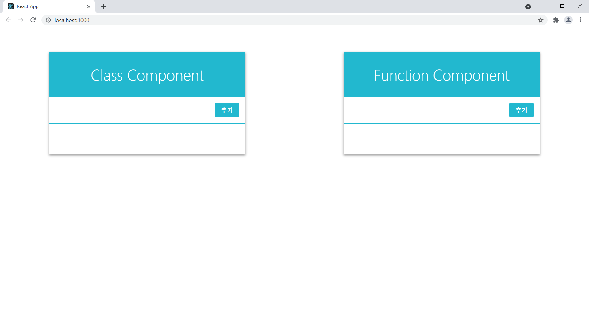

# Introduction

리액트에서 클래스형과 hooks를 사용한 함수형 컴포넌트로 각각 ToDoList를 만든 프로젝트. 리스트는 브라우저의 localStorage에 저장하여 사용한다.

# Start

yarn add  
yarn start

# Skills

- javascript
- react
- react-icons

# 시작 화면

# Demo

# Design

[velopert 블로그 참조](https://velopert.com/3480)
